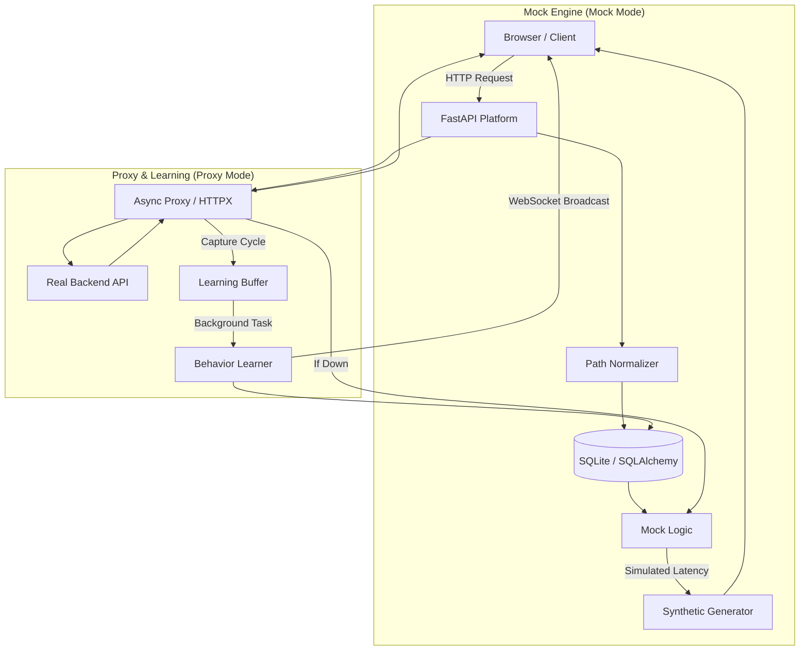

# Intelligent Adaptive Mock Platform 🧬

> **Your API's Digital Twin.** A self-learning middleware that observes real traffic, masters your API contract, and provides high-fidelity mocks with zero configuration.

---

## 🌩️ The Problem Statement

Frontend development is often held hostage by the backend. **When the backend is down, slow, or under development, the frontend team stops moving.** 
- **The "Mock Debt":** Writing manual mocks is tedious and they quickly become outdated compared to the real API.
- **Resilience Blindness:** It’s hard to test how your app handles 500 errors or high latency without actually breaking the production server.

## 💡 The Motivation

This platform acts as a **Digital Twin** for your API. It doesn't just mock; it **learns**. 
By sitting between your app and the real backend, it observes every request and response, building a real-time behavioral model. 
- **Zero-Config Mocks:** Switch from "Proxy" to "Mock" mode, and the platform takes over using learned behavior.
- **Failover-First:** If the real backend crashes, the AI instantly provides a mock fallback—your frontend never sees a "Site Cannot Be Reached" error.
- **Chaos for Quality:** Built-in "Chaos Engine" lets you inject artificial failure and latency to harden your application.

---

## 🛠️ How it Works: The Learning Cycle

### 1. Inbound Intelligence
The platform detects dynamic URL segments automatically.
- **Input:** `GET /users/42`, `GET /users/89`
- **AI Normalization:** `/users/{id}` (Groups these patterns for shared statistics)

### 2. Schema Discovery
It masters the JSON structure of your requests and responses.
- **Request (Inbound):** Learns mandatory fields, data types, and nesting.
- **Response (Outbound):** Captures success/error payloads to generate realistic synthetic data.

### 3. Real-Time Visualization
Uses **WebSockets** for a zero-polling, instant-update dashboard that streams every transaction as it happens.

---

## ⚡ Quick Start (Step-By-Step)

### 1. Set up the Environment
Ensure you have Python 3.8+ installed.
```bash
# Clone and install
pip install -r requirements.txt
```

### 2. Configure and Launch
Define your target backend and a unique database for your current project.
```powershell
# Windows PowerShell Example
$env:TARGET_URL="http://localhost:8001"  # Your real API
$env:DB_NAME="project_alpha.db"          # Isolation for this project
cd src
python mock_server.py
```

### 3. Use the Dashboard
Open your browser to:
- **Control Deck:** `http://localhost:8000/` — Main panel for Chaos and Mode switching.
- **Endpoint Explorer:** `http://localhost:8000/admin/explorer` — Visual patterns and stats.
- **Interactive Docs:** `http://localhost:8000/admin/docs` — Swagger UI for learned APIs.

---

## 📸 Dashboard Preview
*(Insert Mockup Screenshot Here)*
> **Live Monitoring:** The dashboard uses WebSockets to show a real-time stream of traffic, including AI-generated mocks vs real backend responses.

---

## 🏗 System Architecture



---

## 📂 Project Structure
- **`src/mock_server.py`**: The core "Traffic Controller" with WebSocket broadcasting.
- **`src/utils/schema_learner.py`**: The "Brain" that performs recursive JSON structure analysis.
- **`src/utils/normalization.py`**: Regex-driven path grouping engine.
- **`static/`**: High-performance Vanilla JS dashboard with WebSocket clients.

## 💡 Pro-Tip
Run a different `DB_NAME` for every project. This lets you build "Behavioral Profiles" for different microservices and switch between them instantly.
