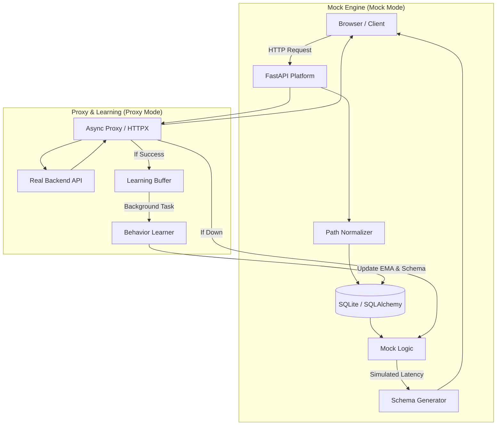

# Intelligent Adaptive Mock Platform 🧬

A scalable, self-learning "Digital Twin" for backend APIs. This platform sits between your frontend and your real backend, learning behavior patterns in real-time and providing a high-fidelity mock fallback with automatic failover.

## 🌟 Key Features

*   **Online Pattern Learning**: Processes proxy traffic to build statistical models of latency and status code distributions via EMA (Exponential Moving Average).
*   **Path Normalization**: Automatically identifies dynamic IDs (UUIDs, integers) and groups them into patterns (e.g., `/api/v1/users/123` -> `/api/v1/users/{id}`).
*   **Automatic AI Fallback**: If the real backend goes offline, the platform instantly switches to its learned AI model to keep the frontend running.
*   **Truth-Based OpenAPI Export**: Generate a Swagger/OpenAPI 3.0 specification from *actual observed production traffic*.
*   **AI Brain Inspector & Manual Override**: Visualize the patterns the AI has learned and manually override schemas to prototype new features ahead of backend development.
*   **Global Mode Switching**: Toggle between "Proxy" (Learning) and "Mock" (Simulating) globally via the dashboard—no frontend code changes required.
*   **Schema-Aware Echoing**: Generates mock responses that "echo" data from the request body (e.g., matching IDs or names) for realistic testing.

## 🚀 Quick Start

1. **Install Dependencies**:
   ```bash
   pip install -r requirements.txt
   ```

2. **Run the Platform**:
   Configure via environment variables to isolate data for different projects.
   ```powershell
   # Windows PowerShell
   $env:TARGET_URL="http://localhost:8001"
   $env:DB_NAME="my_project.db"
   cd src
   python mock_server.py
   ```

3. **Use the Dashboard**:
   Visit `http://localhost:8000` to monitor traffic, toggle modes, inspect the AI's mind, and export contracts.

## 🏗 Architecture



## 📂 System Design

- **`src/mock_server.py`**: FastAPI-based core handling Proxy/Mock logic and Failover.
- **`src/models.py`**: SQLAlchemy schema for the SQLite behavioral database.
- **`src/utils/normalization.py`**: Regex-based path grouping logic.
- **`src/utils/schema_learner.py`**: Recursive JSON structure learning and data correlation engine.

## 💡 Pro-Tip: Data Isolation
Run the server with a different `DB_NAME` for every project you test. This keeps your learned patterns clean and allows you to build specific "behavioral profiles" for different services.
