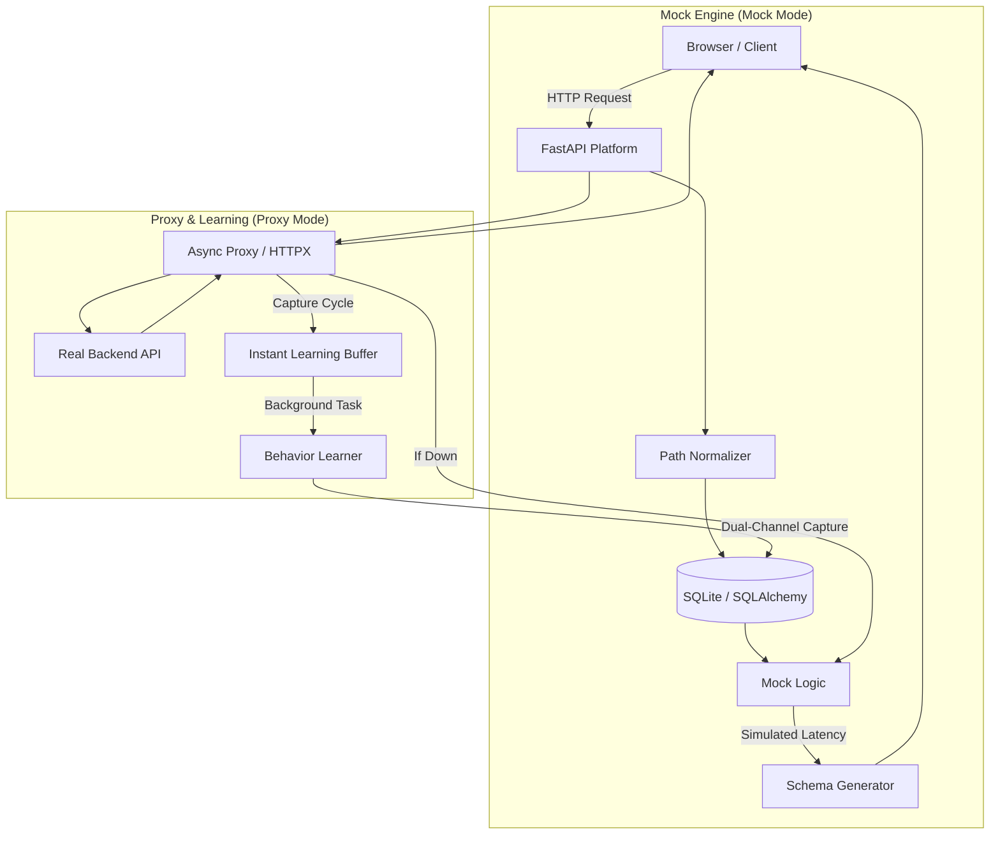

# Intelligent Adaptive Mock Platform 🧬

A scalable, self-learning "Digital Twin" for backend APIs. This platform sits between your frontend and your real backend, learning behavior patterns in real-time and providing a high-fidelity mock fallback with automatic failover.

## 🌟 Key Features

*   **Dual-Channel Intelligence**: Automatically learns both **Request (Inbound)** and **Response (Outbound)** JSON structures. It builds a complete contract of what your app sends and what it receives.
*   **Live Traffic Stream**: A unified server-side log that tracks every request from your real frontend, Postman, or the dashboard—synchronized in real-time across the entire platform.
*   **Direction-Aware Schema Brain**: Separate controls for Inbound patterns and Outbound results. Manually override the AI's knowledge for either side of the transaction.
*   **Visual Endpoint Explorer**: A premium dedicated dashboard showing live latency trends, success rates, and side-by-side schema visualizations for every discovered route.
*   **Automatic AI Failover**: Instantly switches to a high-fidelity mock if the target backend is unreachable, ensuring zero frontend downtime during backend maintenance or crashes.
*   **Path Normalization & Parameter Detection**: Identifies dynamic segments (IDs, UUIDs) and automatically groups them (e.g., `/users/123` → `/users/{id}`).
*   **Interactive Documentation (Swagger)**: Generates a professional OpenAPI 3.0 spec pre-filled with learned request bodies for one-click testing.
*   **Self-Healing Database**: Automatic schema migrations ensure your local data stays up-to-date with current platform logic.

## 🚀 Quick Start

1. **Install Dependencies**:
   ```bash
   pip install -r requirements.txt
   ```

2. **Configure and Launch**:
   Define your target backend and a unique database for your current project.
   ```powershell
   # Windows PowerShell Example
   $env:TARGET_URL="http://localhost:8001"
   $env:DB_NAME="project_alpha.db"
   cd src
   python mock_server.py
   ```

3. **Explore the Interface**:
   *   **Control Deck**: `http://localhost:8000/` — Manage chaos levels, global modes, and live traffic.
   *   **Endpoint Explorer**: `http://localhost:8000/admin/explorer` — Deep dive into learned behavior and stats.
   *   **API Docs (Swagger)**: `http://localhost:8000/admin/docs` — Full interactive testing suite.

## 🏗 Architecture



## 📂 System Design

- **`src/mock_server.py`**: Core FastAPI engine handling Proxy logic, Global State, and Real-time Log Synchronization.
- **`src/models.py`**: Data models for dual-channel schemas (Request/Response), chaos configuration, and endpoint metadata.
- **`src/utils/normalization.py`**: Regex engine for grouping dynamic paths and extracting parameters.
- **`src/utils/schema_learner.py`**: The "AI Brain"—recursive JSON structure analysis and synthetic response generation.

## 💡 Pro-Tip: Data Isolation
Run the server with a different `DB_NAME` for every project you test. This allows you to build specific "behavioral profiles" for different services and switch between them instantly by changing a single environment variable.
