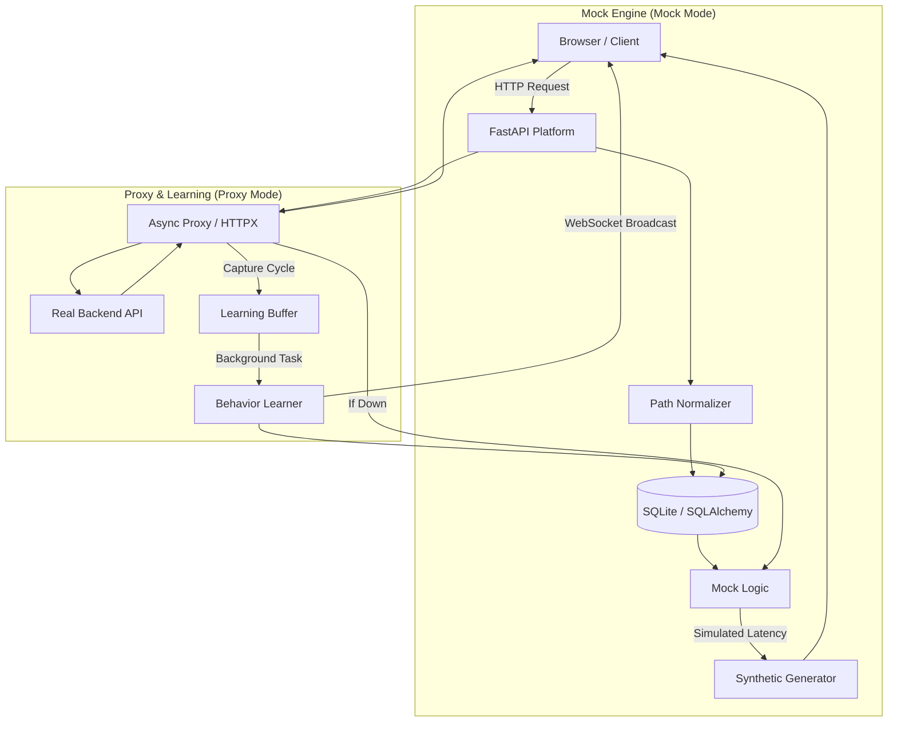

# Intelligent Adaptive Mock Platform 🧬

> **Your API's Digital Twin.** A self-learning middleware that observes real traffic, masters your API contract, and provides high-fidelity mocks with zero configuration. Now with **AI-powered anomaly detection**, **smart mock generation**, and a **contract change narrator**.

---

## 🌩️ The Problem Statement

Frontend development is often held hostage by the backend. **When the backend is down, slow, or under development, the frontend team stops moving.** 
- **The "Mock Debt":** Writing manual mocks is tedious and they quickly become outdated compared to the real API.
- **Resilience Blindness:** It’s hard to test how your app handles 500 errors or high latency without actually breaking the production server.

## 💡 The Motivation

This platform acts as a **Digital Twin** for your API. It doesn't just mock; it **learns**. 
By sitting between your app and the real backend, it observes every request and response, building a real-time behavioral model. 
- **Zero-Config Mocks:** Switch from "Proxy" to "Mock" mode, and the platform takes over using learned behavior.
- **Failover-First:** If the real backend crashes, the AI instantly provides a mock fallback—your frontend never sees a "Site Cannot Be Reached" error.
- **Chaos for Quality:** Built-in "Chaos Engine" lets you inject artificial failure and latency to harden your application.
- **Contract Regression Watchdog:** Automatically detects when the backend API changes in breaking ways (missing fields, type changes) and alerts you instantly—preventing silent production failures.

---

## 🛠️ How it Works: The Learning Cycle

### 1. Inbound Intelligence
The platform detects dynamic URL segments automatically using 5 pattern detectors:

| Pattern | Example Input | Normalized Output |
|---|---|---|
| Numeric IDs | `/users/42` | `/users/{id}` |
| UUIDs | `/users/550e8400-e29b-...` | `/users/{id}` |
| Hex Hashes | `/files/a1b2c3d4e5f6...` | `/files/{hash}` |
| URL Slugs | `/posts/my-first-blog-post` | `/posts/{slug}` |
| Base64 Tokens | `/confirm/eyJhbGci...` | `/confirm/{token}` |

### 2. Schema Discovery & Smart Mock Generation
It masters the JSON structure of your requests and responses.
- **Request (Inbound):** Learns mandatory fields, data types, and nesting.
- **Response (Outbound):** Captures success/error payloads and uses **40+ field-name heuristics** to generate varied, realistic mock data (names, emails, UUIDs, dates, prices, addresses, and more).

### 3. Real-Time Analytics & Visualization
The platform provides two primary interfaces for monitoring your API ecosystem:
- **Live Transaction Stream:** Uses **WebSockets** for a zero-polling dashboard that shows every request, backend latency, and chaos injection as it happens.
- **Intelligence Explorer:** Detailed structural analysis of your API's lifecycle, featuring **optimized polling** and **consolidated endpoints** for viewing learned schemas and contract drift history.

---

## ⚡ Quick Start (Step-By-Step)

### 1. Set up the Environment
Ensure you have Python 3.8+ installed.
```bash
# Clone and install
pip install -r requirements.txt
```

### 2. Configure and Launch
Define your target backend and a unique database for your current project.
```powershell
# Windows PowerShell Example
$env:TARGET_URL="http://localhost:8001"  # Your real API
$env:DB_NAME="project_alpha.db"          # Isolation for this project
cd src
python mock_server.py
```

### 3. Use the Dashboard
Open your browser to:
- **Control Deck:** `http://localhost:8000/` — Main panel for Chaos and Mode switching (Real-time WebSockets).
- **Endpoint Explorer:** `http://localhost:8000/admin/explorer` — Structural patterns, learned schemas, and contract drift history with **search and pagination**.
- **Interactive Docs:** `http://localhost:8000/admin/docs` — Swagger UI for learned APIs.

---

## 📸 Dashboard Preview
*(Insert Mockup Screenshot Here)*
> **Live Monitoring:** The dashboard uses WebSockets to show a real-time stream of traffic, including AI-generated mocks vs real backend responses.

---

## 🏗 System Architecture



---

## 🚨 Contract Regression Watchdog

The platform continuously monitors your API for **contract drift**—when the real backend's response structure changes in ways that could break your frontend.

### What It Detects:
- **Missing Fields:** Fields that existed in the learned schema but are now absent from responses
- **New Fields:** Unexpected fields that appear in responses (low severity)
- **Type Changes:** When a field changes from `string` to `number`, `object` to `array`, etc.

### How It Works:
1. **Learning Phase:** The platform observes real API responses and builds a schema model
2. **Monitoring Phase:** Every subsequent proxy request is compared against the learned schema
3. **Alert Generation:** When drift is detected, an alert is stored with:
   - **Drift Score** (0-100): Severity of the changes
   - **Drift Summary:** Human-readable description (e.g., "2 critical issues, 1 warning")
   - **Drift Details:** Exact list of what changed and where

### 🤖 AI Contract Change Narrator

Raw drift details are automatically translated into **plain-English, actionable reports** by the AI Narrator. Each issue includes:

| Label | Meaning |
|---|---|
| 🔴 **BREAKING** | A field was removed or its type changed—**will cause frontend failures** |
| 🟡 **WARNING** | A type mismatch detected—**may cause silent bugs** in comparisons or rendering |
| 🟢 **INFO** | A new field appeared—**typically safe** but indicates an evolving API |

Each narrated issue also includes:
- **Field Context:** What the field relates to (e.g., "user profile images", "authentication tokens")
- **Impact Assessment:** Explains what will break (e.g., "Any strict comparisons (===) will fail silently")
- **Recommended Action:** Specific fix (e.g., "Add a null-check or optional chaining (?.) for this field")

The narration appears in both the **server console logs** and the **Explorer UI** (togglable between human-readable and raw technical view).

### Accessing Drift Alerts:
- **API Endpoint:** `GET /admin/drift-alerts?unresolved_only=true`
- **Per-Endpoint Stats:** `GET /admin/endpoints/{id}/drift-stats`
- **Resolve Alert:** `POST /admin/drift-alerts/{alert_id}/resolve`

**Use Case:** If your backend team renames `user_id` to `userId` without telling you, the Watchdog will immediately flag it as a **high-severity** drift and the AI Narrator will explain: *"The 'user_id' field has been REMOVED from the response → This field is related to unique identifiers. Impact: This will break any UI component that renders or references this field."*

---

## 🩺 AI Anomaly Detection — Traffic Health Score

The platform continuously monitors every proxied request against learned behavioral baselines to **detect anomalies before they become incidents**.

### What It Monitors:

| Detector | Trigger Condition | Use Case |
|---|---|---|
| **Latency Spike** | Current latency > 2σ from learned mean | Detects backend slowdowns or infrastructure issues |
| **Error Rate Spike** | Error rate jumps >3x from baseline in sliding window | Catches cascading failures and deployment regressions |
| **Response Size Drift** | Response body size changes >3x from average | Detects data truncation, empty payloads, or inflated responses |
| **Contract Drift Penalty** | Endpoint has an active unresolved drift alert | Integrates structural drift into the health score |

### Health Score (0–100)

Each endpoint receives a **health score** from 0 to 100, where 100 means fully healthy:

| Icon | Status | Score Range | Meaning |
|---|---|---|---|
| 🟢 | **HEALTHY** | 80 – 100 | All metrics are within normal baselines. No anomalies detected. |
| 🟡 | **DEGRADED** | 50 – 79 | One or more anomalies detected. Performance is outside normal parameters. Review recommended. |
| 🔴 | **CRITICAL** | 0 – 49 | Multiple severe anomalies. Endpoint is experiencing significant issues. Immediate attention required. |

### Score Penalties:

| Anomaly Type | Penalty | Notes |
|---|---|---|
| Latency Spike | **-15 to -22.5 pts** | Higher penalty for extreme spikes (>4σ) |
| Error Rate Spike | **-25 to -37.5 pts** | Higher penalty when error rate exceeds 5x baseline |
| Response Size Drift | **-10 pts** | Possible data truncation or corruption |
| Active Contract Drift | **-20 pts** | Structural changes compound behavioral anomalies |

### Global Platform Health:

The global score is a weighted blend across all monitored endpoints:
- **70%** average of all endpoint scores
- **30%** worst individual endpoint score

This ensures a single critically failing endpoint pulls the global score down proportionally.

### Dashboard Integration:
- **🏠 Control Deck:** A **global health banner** at the top shows the platform-wide score, number of monitored endpoints, and active anomaly count. Updates in real-time via WebSocket.
- **📡 Live Stream:** Each request in the log table shows a 🟢🟡🔴 health indicator.
- **🔬 Explorer:** Each endpoint card displays its health badge, current status, and a detailed **Active Anomalies** panel listing each detected issue.

### Accessing Health Data:
- **All Endpoints:** `GET /admin/health` — Returns global score + per-endpoint health
- **Global Only:** `GET /admin/health/global` — Platform-wide aggregated score
- **Per-Endpoint:** `GET /admin/health/{endpoint_id}` — Current health + recent metric history

---

## 🔬 API Intelligence Explorer

The Explorer is designed for deep structural analysis of your API landscape. It handles large-scale environments through several key optimizations:

### Key Features:
- **Scalable Architecture:** Implements **server-side pagination and search** to handle thousands of endpoints without browser lag.
- **Consolidated Data Fetching:** Uses a single optimized endpoint (`/admin/explorer/overview`) to retrieve behavior stats, schema previews, and active drift alerts in one round-trip.
- **Live Sync Controls:**
    - **Toggle Auto-Sync:** Enable or disable periodic background refreshes.
    - **Manual Refresh:** Trigger an instant state update from the server.
- **Schema Deep-Dive:** View learned request and response schemas in a high-fidelity editor-style view.

---

## 📂 Project Structure

| File | Role |
|---|---|
| `src/mock_server.py` | Core Traffic Controller — routing, proxy, mock generation, WebSocket broadcasting, health monitoring |
| `src/models.py` | SQLAlchemy models — `Endpoint`, `EndpointBehavior`, `ChaosConfig`, `ContractDrift`, `HealthMetric` |
| `src/utils/schema_learner.py` | Schema Discovery Brain — recursive JSON analysis + smart mock data generation with 40+ heuristics |
| `src/utils/normalization.py` | Path Intelligence — 5-pattern regex engine (IDs, UUIDs, hashes, slugs, tokens) |
| `src/utils/drift_detector.py` | Contract Watchdog — structural drift detection + AI Narrator for plain-English reports |
| `src/utils/health_monitor.py` | Health Monitor — sliding-window anomaly detection for latency, errors, size, and drift |
| `src/tests/` | Verification test suites for all core utility modules |
| `static/index.html` | Control Deck dashboard — Chaos Engine, mode switching, live stream, health banner |
| `static/explorer.html` | API Explorer — endpoint cards, schemas, drift alerts, health indicators |
| `static/landing.html` | Landing page — project overview and feature highlights |

## 💡 Pro-Tip
Run a different `DB_NAME` for every project. This lets you build "Behavioral Profiles" for different microservices and switch between them instantly.
