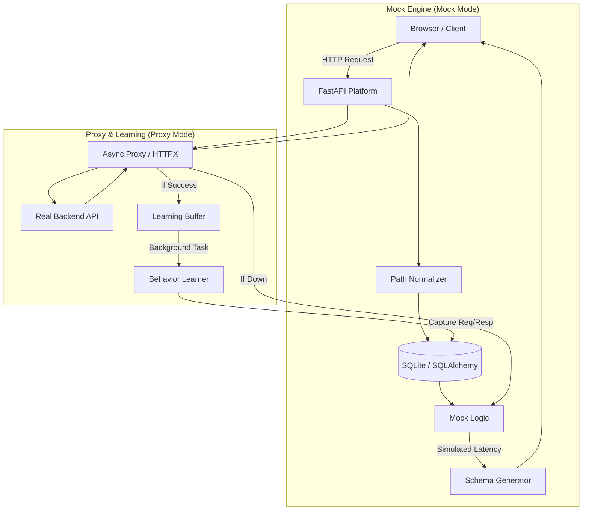

# Intelligent Adaptive Mock Platform 🧬

A scalable, self-learning "Digital Twin" for backend APIs. This platform sits between your frontend and your real backend, learning behavior patterns in real-time and providing a high-fidelity mock fallback with automatic failover.

## 🌟 Key Features

*   **Dual-Intelligence Learning**: Automatically learns both **Request** and **Response** JSON structures for every endpoint, including `POST`, `PUT`, and `PATCH` methods.
*   **Path Normalization & Parameter Detection**: Identifies dynamic segments (IDs, UUIDs) and automatically extracts them as interactive parameters in documentation.
*   **Automatic AI Fallback**: Instantly switches to a high-fidelity mock if the target backend is unreachable, ensuring zero frontend downtime.
*   **Interactive Documentation (Swagger)**: Generates a professional OpenAPI 3.0 spec with a full Swagger UI suite for testing learned endpoints.
*   **Visual Endpoint Explorer**: A premium dedicated dashboard showing live stats (latency, success rates) and side-by-side schema visualizations.
*   **AI Brain & Manual Overrides**: Real-time visualization of learned patterns with the ability to manually "teach" the AI new behaviors.
*   **Schema-Aware Echoing**: Mocks intelligently "echo" data from the request body (e.g., matching IDs) to create highly realistic interactions.
*   **Self-Healing Database**: Automatic schema migrations ensure your local data stays up-to-date with current platform logic.

## 🚀 Quick Start

1. **Install Dependencies**:
   ```bash
   pip install -r requirements.txt
   ```

2. **Run the Platform**:
   Configure via environment variables to isolate data for different projects.
   ```powershell
   # Windows PowerShell
   $env:TARGET_URL="http://localhost:8001"
   $env:DB_NAME="my_project.db"
   cd src
   python mock_server.py
   ```

3. **Explore the Interface**:
   *   **Console Deck**: `http://localhost:8000/` (Traffic & Global Controls)
   *   **Endpoint Explorer**: `http://localhost:8000/admin/explorer` (Stats & Schemas)
   *   **API Docs (Swagger)**: `http://localhost:8000/admin/docs` (Interactive Testing)

## 🏗 Architecture



## 📂 System Design

- **`src/mock_server.py`**: Core FastAPI engine handling Proxy logic, AI Failover, and Automated Migrations.
- **`src/models.py`**: Data models for behavioral patterns, chaos configuration, and schema storage.
- **`src/utils/normalization.py`**: Regex engine for grouping dynamic paths and extracting parameters.
- **`src/utils/schema_learner.py`**: The "AI Brain"—recursive JSON structure analysis and request/response correlation.

## 💡 Pro-Tip: Data Isolation
Run the server with a different `DB_NAME` for every project you test. This keeps your learned patterns clean and allows you to build specific "behavioral profiles" for different services.
