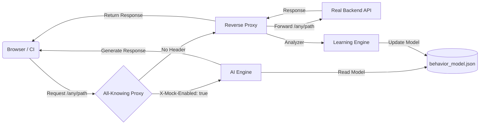

# Evolutionary API Mock Suite 🧬

A production-grade "Digital Stunt Double" for backend APIs.

This tool acts as a **Learning Proxy** that sits between your frontend and the real world. Ideally suited for Chaos Engineering, Frontend Testing, and CI/CD pipelines.

## 🌟 Key Features

*   **Universal Proxy (Ghost Fire)**: Transparently forwards *any* request path to your backend while learning its behavior.
*   **Universal Mock (Rocket Fire)**: Simulates responses for *any* endpoint using AI-learned probability distributions.
*   **Chaos Engine**: Inject artificial failures (e.g., "50% chance of 500 Error") via UI or API.
*   **Live Intelligence Dashboard**: Real-time monitoring of Real vs. AI latency distributions.

## 🏗 Architecture



## 🚀 Quick Start

### 1. Installation
```bash
pip install -r requirements.txt
```

### 2. Configure & Run
```bash
# Optional: Set your real backend (Defaults to httpbin.org)
set TARGET_URL=https://api.my-real-service.com

# Start the Suite
cd src
python mock_server.py
```

### 3. Usage
- **Dashboard**: [http://127.0.0.1:8000](http://127.0.0.1:8000)
- **Universal Endpoint**: `http://127.0.0.1:8000/<any_path>`

## 📁 Project Structure

```
/mock-api
  ├── /src                # Core Logic
  │   ├── mock_server.py  # Universal Proxy & Mock
  │   ├── analyzer_engine # Learning Logic
  │   └── generate_logs   # Synthetic Data Generator
  ├── /static             # Frontend Assets
  │   └── index.html      # Dashboard with Chart.js
  ├── /data               # Persistence Layer
  │   └── behavior_model.json
  └── requirements.txt
```

## 💡 Why use this?
1.  **Stop Hardcoding Mocks**: Static JSON mocks don't evolve. This tool updates itself based on real production traffic.
2.  **Test "Bad Days"**: Verify if your app handles "Slow Fridays" (high latency) without crashing.
3.  **Frontend Autonomy**: Backend down? Switch to Mock Mode and keep coding.
