# Evolutionary API Mock Suite 🧬

A production-grade "Digital Stunt Double" for backend APIs.

This tool acts as a **Learning Proxy** that sits between your frontend and the real world. Ideally suited for Chaos Engineering, Frontend Testing, and CI/CD pipelines.

# Intelligent Adaptive Mock Platform 🧬

A scalable, production-ready "Digital Stunt Double" for backend APIs that grows more accurate with every request.

## 🌟 Key Features

*   **Multi-Endpoint Intelligence**: Automatically learns and adapts behavior (latency, error rates, status codes) individually for every endpoint.
*   **Path Normalization**: Smart grouping of dynamic paths (e.g., `/users/123` and `/users/456` are treated as `/users/{id}`).
*   **Schema-Aware Mocking**: Observes real response shapes and synthesizes mock bodies that mimic production data.
*   **Scoped Chaos Engineering**: Inject latency or failures specifically into certain endpoints without affecting the whole system.
*   **Async Performance**: Built with FastAPI and `httpx` for high-concurrency proxying.
*   **Persistent SQLite Storage**: Structured storage of endpoint behaviors, patterns, and chaos configurations.

## 🏗 Architecture

```mermaid
graph TD
    Client[Browser / Client] -->|HTTP Request| Server[FastAPI Platform]
    
    subgraph "Mock Engine (X-Mock-Enabled: true)"
        Server --> Norm[Path Normalizer]
        Norm --> DB[(SQLite / SQLAlchemy)]
        DB --> Logic[Mock Logic]
        Logic -->|Simulated Latency| Gen[Schema Generator]
        Gen --> Client
    end
    
    subgraph "Proxy & Learning (X-Mock-Enabled: false)"
        Server --> Proxy[Async Proxy / HTTPX]
        Proxy --> Target[Real Backend API]
        Target --> Proxy
        Proxy --> Buffer[Learning Buffer]
        Buffer -->|Background Task| Learner[Behavior Learner]
        Learner -->|Update EMA & Schema| DB
        Proxy --> Client
    end
```



## 🚀 Quick Start

### 1. Installation
```bash
pip install -r requirements.txt
```

### 2. Configure & Run
```bash
# Set your real backend (Defaults to httpbin.org)
$env:TARGET_URL="https://api.my-real-service.com"

# Start the Platform
cd src
python mock_server.py
```

### 3. Usage
- **Admin API**: `http://127.0.0.1:8000/admin/endpoints`
- **Dynamic Mocking**: Add header `X-Mock-Enabled: true` to your requests.
- **Path Normalization**: Use segments like `/users/123` to see them grouped as `/users/{id}` in the admin panel.

## 📁 System Design

*   **`src/mock_server.py`**: The FastAPI core handling routing, proxying, and mock generation.
*   **`src/models.py`**: Database schema for endpoints, behavior distributions, and chaos config.
*   **`src/utils/normalization.py`**: Regex-based path normalization for identifying variable segments.
*   **`src/utils/schema_learner.py`**: Logic for merging observed response structures into a representative mock schema.

## 💡 Production Readiness
- **Thread-Safe**: Uses `asyncio.Lock` and SQLAlchemy's async session management.
- **Scalable Storage**: SQLite is used for local persistence, but easily switchable to PostgreSQL via SQLAlchemy.
- **Non-blocking Learning**: Learning happens in background tasks to avoid impacting request latency.
